# COMP1019 - Lập trình trên Windows

## Lab 02 - Quản lý mảng số nguyên bằng C#

## 1. Giới thiệu

Chương trình xây dựng một menu cho phép người dùng quản lý và xử lý một mảng số nguyên. Sau khi thực hiện một chức năng, chương trình sẽ quay lại menu để người dùng tiếp tục lựa chọn cho đến khi chọn **0 - Thoát**.

Chương trình được được thực hiện bằng ngôn ngữ **C#** dưới dạng **Console App**.

---

## 2. Chức năng chương trình

Chương trình gồm các chức năng:

| Lựa chọn | Chức năng                | Mô tả                                         |
| -------- | ------------------------ | --------------------------------------------- |
| 1        | Nhập mảng                | Nhập số lượng phần tử và các phần tử của mảng |
| 2        | Xuất mảng                | In toàn bộ phần tử của mảng                   |
| 3        | Tính tổng                | Tính và in tổng các phần tử                   |
| 4        | Tìm lớn nhất và nhỏ nhất | Tìm và in giá trị lớn nhất, nhỏ nhất          |
| 5        | Đếm chẵn/lẻ              | Đếm số lượng phần tử chẵn và lẻ               |
| 6        | Sắp xếp tăng dần         | Sắp xếp mảng theo thứ tự tăng dần             |
| 7        | Tìm kiếm                 | Tìm vị trí xuất hiện đầu tiên của một giá trị |
| 0        | Thoát                    | Kết thúc chương trình                         |

---

## 3. Yêu cầu kỹ thuật

* Sử dụng **C# Console App**.
* Không viết toàn bộ chương trình trong `Main()`.
* Chương trình được chia thành nhiều phương thức riêng biệt.
* Kiểm tra dữ liệu nhập số nguyên.
* Kiểm tra số lượng phần tử phải là số nguyên dương.
* Kiểm tra lựa chọn menu.
* Không cho thực hiện các chức năng xử lý khi chưa nhập mảng.
* Sử dụng tên biến và tên phương thức rõ nghĩa.
* Chương trình không bị dừng khi người dùng nhập dữ liệu không hợp lệ.

---

## 4. Các phương thức chính

Chương trình được chia thành các phương thức:

```
NhapSoNguyen()
NhapSoNguyenDuong()
NhapMang()
XuatMang()
TinhTong()
TimMax()
TimMin()
DemChan()
DemLe()
SapXepTangDan()
TimKiem()
HienThiMenu()
Main()
```

### `NhapSoNguyen()`

Nhập một số nguyên từ bàn phím và kiểm tra dữ liệu nhập bằng `int.TryParse()`.

### `NhapSoNguyenDuong()`

Nhập số nguyên dương. Giá trị nhập phải lớn hơn `0`.

### `NhapMang()`

Nhập số lượng phần tử `n`, sau đó nhập từng phần tử của mảng.

### `XuatMang()`

Xuất toàn bộ phần tử của mảng ra màn hình.

### `TinhTong()`

Tính tổng tất cả các phần tử trong mảng.

### `TimMax()`

Tìm giá trị lớn nhất trong mảng.

### `TimMin()`

Tìm giá trị nhỏ nhất trong mảng.

### `DemChan()`

Đếm số lượng phần tử chẵn trong mảng.

### `DemLe()`

Đếm số lượng phần tử lẻ trong mảng.

### `SapXepTangDan()`

Sắp xếp các phần tử trong mảng theo thứ tự tăng dần.

### `TimKiem()`

Tìm kiếm một giá trị `x` trong mảng và trả về vị trí xuất hiện đầu tiên. Nếu không tìm thấy, phương thức trả về `-1`.

### `HienThiMenu()`

Hiển thị menu chức năng của chương trình.

---

## 5. Menu chương trình

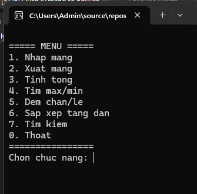

## 6. Dữ liệu kiểm thử

### Dữ liệu được sử dụng để kiểm thử chương trình:

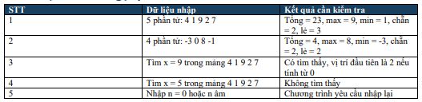

### Test 1: Kiểm tra kết quả (n = 5)

### Test 1.1: Nhập và xuất mảng

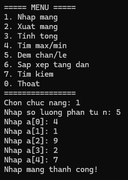

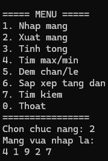

### Test 1.2: Tính tổng, tìm max, min, đếm chẵn/lẻ,	sắp xếp, tìm kiếm

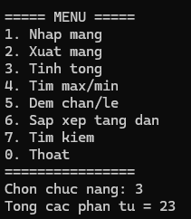

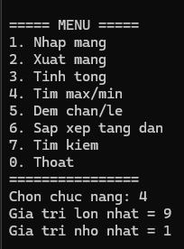

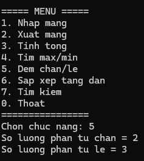

### Kết quả tìm thấy giá trị

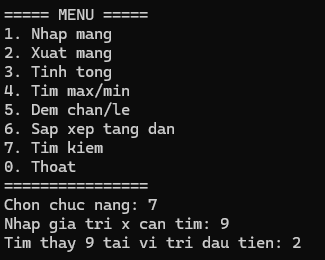

### Kết quả không tìm thấy giá trị

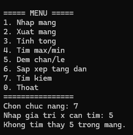

### Lưu ý: Khi tìm kiếm, giá trị sẽ thay đổi nếu được sắp xếp trước đó. Nếu muốn tìm kiếm giá trị ban đầu, hãy thực hiện chức năng tìm kiếm trước khi sắp xếp.

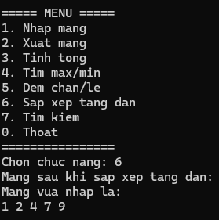

### Test 2: Kiểm tra kết quả (n = 4)

### Test 2.1: Nhập và xuất mảng

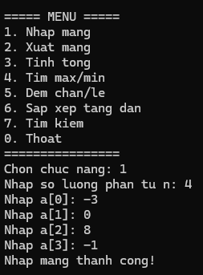

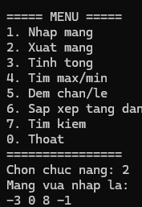

### Test 2.2: Tính tổng, tìm max, min, đếm chẵn/lẻ

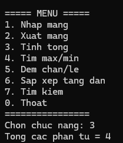

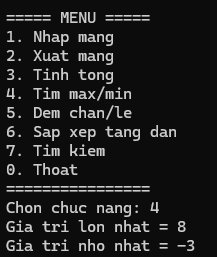

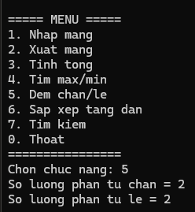

### Test 3: Những trường hợp nhập dữ liệu không hợp lệ

### Test 3.1: Nhập n = 0 hoặc n âm

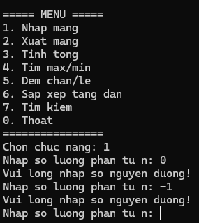

### Test 3.2: Chưa nhập mảng mà đã chọn các chức năng xử lý

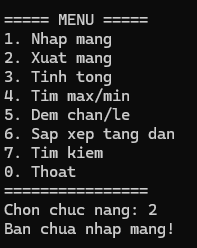

### Test 3.3: Nhập dữ liệu vào Menu chọn chức năng không hợp lệ

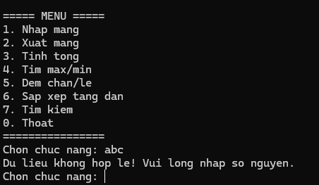

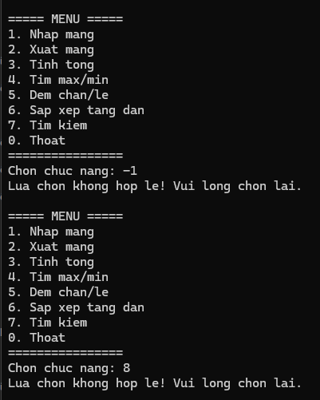

### Test 4: Thoát chương trình

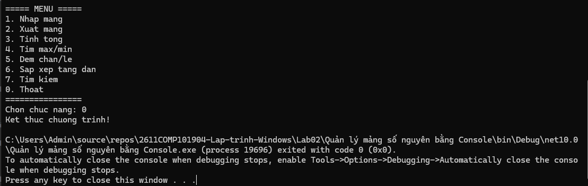