# COMP1019 - Lập trình trên Windows

## Lab 04 - Exception, Delegate/Event, Func/Action và Generic trong C#

## 1. Giới thiệu

Chương trình xây dựng một ứng dụng **quản lý sản phẩm bằng Console** theo hướng lập trình hướng đối tượng trong C#.

Chương trình sử dụng `Repository<T>` để lưu trữ danh sách sản phẩm trong bộ nhớ. Đồng thời áp dụng các kiến thức về **Exception, Delegate/Event, Func, Action và Generic** để xử lý lỗi, thông báo khi dữ liệu thay đổi và tìm kiếm, lọc dữ liệu.

Sau khi thực hiện một chức năng, chương trình sẽ quay lại menu để người dùng tiếp tục lựa chọn cho đến khi chọn **0 - Thoát**.

Chương trình được thực hiện bằng ngôn ngữ **C#** dưới dạng **Console App**.

---

## 2. Chức năng chương trình

Chương trình gồm các chức năng:

| Lựa chọn | Chức năng             | Mô tả                                            |
| -------- | --------------------- | ------------------------------------------------ |
| 1        | Thêm sản phẩm         | Nhập mã, tên, đơn giá và số lượng sản phẩm       |
| 2        | Xuất danh sách        | In toàn bộ danh sách sản phẩm                    |
| 3        | Tìm theo mã           | Tìm và in thông tin sản phẩm theo mã             |
| 4        | Tìm theo tên          | Tìm các sản phẩm có tên chứa từ khóa             |
| 5        | Lọc theo khoảng giá   | Lọc sản phẩm theo giá nhỏ nhất và lớn nhất       |
| 6        | Xóa sản phẩm          | Xóa sản phẩm theo mã sản phẩm                    |
| 7        | Tính tổng giá trị kho | Tính tổng đơn giá × số lượng của tất cả sản phẩm |
| 0        | Thoát                 | Kết thúc chương trình                            |

---

## 3. Yêu cầu kỹ thuật

* Sử dụng **C# Console App**.
* Sử dụng `try-catch` để xử lý exception.
* Sử dụng `throw` để phát sinh exception khi dữ liệu không hợp lệ.
* Có ít nhất **2 exception tự tạo**.
* Có generic class `Repository<T>`.
* `Repository<T>` sử dụng constraint:

```csharp
where T : IEntity
```

* Sử dụng `IEntity` để làm ràng buộc generic cho `Repository<T>`.
* Có event khi thêm sản phẩm thành công.
* Có event khi xóa sản phẩm thành công.
* Sử dụng `Func<Product, bool>` trong chức năng lọc hoặc tìm kiếm.
* Không viết toàn bộ chương trình trong `Main()`.
* Tách phần xử lý dữ liệu thành `Repository<T>` và `ProductService`.
* `Price` và `Quantity` không được nhận giá trị âm.
* Mã sản phẩm không được rỗng và không được trùng.
* Xử lý trường hợp sản phẩm không tồn tại bằng exception phù hợp.
* Chương trình không bị dừng đột ngột khi người dùng nhập dữ liệu không hợp lệ.
* Tên biến, tên class và tên phương thức rõ nghĩa.

---

## 4. Các class và thành phần chính

Chương trình có thể được chia thành các thành phần:

```text
IEntity.cs
Product.cs
DuplicateProductException.cs
ProductNotFoundException.cs
Repository.cs
ProductService.cs
Program.cs
```

---

### `IEntity.cs`

`IEntity` là interface được sử dụng làm ràng buộc cho generic class `Repository<T>`.

Interface chứa property:

```csharp
string Id { get; }
```

Property `Id` được sử dụng để xác định mã của đối tượng trong repository.

Ví dụ:

```csharp
public interface IEntity
{
    string Id { get; }
}
```

---

### `Product.cs`

Class `Product` dùng để biểu diễn thông tin của một sản phẩm.

Các property:

```text
MaSP
TenSP
Price
Quantity
```

Class có constructor để khởi tạo thông tin sản phẩm.

Ngoài ra, class `Product` có phương thức:

```text
ToString()
```

dùng để hiển thị thông tin sản phẩm.

`Product` triển khai interface `IEntity` để có thể sử dụng với `Repository<T>`.

Các dữ liệu cần kiểm tra:

```text
Price >= 0
Quantity >= 0
MaSP không được rỗng
```

---

### `DuplicateProductException.cs`

Đây là exception tự tạo dùng để xử lý trường hợp thêm sản phẩm có mã đã tồn tại trong danh sách.

Ví dụ:

```text
Mã sản phẩm SP001 đã tồn tại!
```

Exception này được phát sinh khi người dùng cố gắng thêm sản phẩm có mã bị trùng.

---

### `ProductNotFoundException.cs`

Đây là exception tự tạo dùng khi không tìm thấy sản phẩm cần thao tác.

Exception này được sử dụng trong các trường hợp như:

* Xóa sản phẩm không tồn tại.
* Sửa hoặc thao tác với sản phẩm không tồn tại.

Ví dụ:

```text
Không tìm thấy sản phẩm có mã SP001!
```

---

### `Repository<T>.cs`

`Repository<T>` là generic class dùng để quản lý danh sách các đối tượng.

Generic class sử dụng constraint:

```csharp
where T : IEntity
```

Các phương thức chính:

```text
Add()
Remove()
FindById()
Find()
GetAll()
```

Repository chịu trách nhiệm lưu trữ và thao tác với danh sách đối tượng.

Danh sách được lưu trong bộ nhớ bằng:

```csharp
List<T>
```

---

### `Add()`

Thêm một đối tượng vào repository.

Trong chương trình quản lý sản phẩm, phương thức này được sử dụng để thêm sản phẩm mới.

Nếu sản phẩm có mã đã tồn tại, `DuplicateProductException` sẽ được phát sinh.

---

### `Remove()`

Xóa đối tượng dựa trên mã `Id`.

Nếu không tìm thấy đối tượng cần xóa, chương trình phát sinh:

```text
ProductNotFoundException
```

---

### `FindById()`

Tìm một đối tượng dựa trên mã `Id`.

Phương thức được sử dụng để tìm sản phẩm theo mã sản phẩm.

---

### `Find()`

Tìm kiếm các đối tượng dựa trên điều kiện.

Phương thức này có thể sử dụng:

```csharp
Func<T, bool>
```

để truyền điều kiện tìm kiếm hoặc lọc.

---

### `GetAll()`

Lấy toàn bộ danh sách đối tượng hiện có trong repository.

Trong chương trình, phương thức này được sử dụng để xuất toàn bộ danh sách sản phẩm.

---

### `ProductService.cs`

`ProductService` chịu trách nhiệm xử lý các nghiệp vụ liên quan đến sản phẩm.

Các phương thức chính:

```text
AddProduct()
RemoveProduct()
Search()
Filter()
```

Ngoài ra, `ProductService` phát event khi sản phẩm được thêm hoặc xóa thành công.

---

### `AddProduct()`

Kiểm tra nghiệp vụ và thêm sản phẩm vào `Repository<Product>`.

Các bước xử lý:

1. Kiểm tra mã sản phẩm.
2. Kiểm tra mã có bị trùng hay không.
3. Kiểm tra giá và số lượng.
4. Thêm sản phẩm vào repository.
5. Phát event thông báo sản phẩm đã được thêm.

---

### `RemoveProduct()`

Xóa sản phẩm dựa trên mã sản phẩm.

Nếu sản phẩm tồn tại:

* Xóa sản phẩm.
* Phát event thông báo sản phẩm đã được xóa.

Nếu không tồn tại:

```text
ProductNotFoundException
```

được phát sinh.

---

### `Search()`

Thực hiện tìm kiếm sản phẩm theo điều kiện.

Chức năng tìm kiếm theo tên có thể sử dụng:

```csharp
Func<Product, bool>
```

Ví dụ:

```csharp
product => product.TenSP.Contains(keyword)
```

---

### `Filter()`

Lọc danh sách sản phẩm dựa trên điều kiện.

Trong bài này, `Func<Product, bool>` được sử dụng để lọc sản phẩm theo khoảng giá.

Ví dụ:

```csharp
product => product.Price >= minPrice
        && product.Price <= maxPrice
```

---

### `Event`

Chương trình sử dụng event để thông báo khi dữ liệu thay đổi.

Các trường hợp phát event:

```text
Thêm sản phẩm thành công
Xóa sản phẩm thành công
```

Ví dụ thông báo:

```text
Đã thêm sản phẩm thành công!
Đã xóa sản phẩm thành công!
```

---

### `Func<Product, bool>`

`Func<Product, bool>` được sử dụng để truyền điều kiện vào các phương thức tìm kiếm hoặc lọc.

Ví dụ:

```csharp
Func<Product, bool> dieuKien =
    product => product.Price >= minPrice &&
               product.Price <= maxPrice;
```

Sau đó điều kiện được sử dụng để lọc danh sách sản phẩm.

---

### `Action`

`Action` có thể được sử dụng để thực hiện một hành động không trả về giá trị.

Ví dụ, có thể sử dụng `Action` để hiển thị thông báo khi sản phẩm được thêm hoặc xóa thành công.

---

### `Program.cs`

Class `Program` chứa phương thức `Main()` và điều khiển luồng chính của chương trình.

`Program` thực hiện:

* Hiển thị menu.
* Nhận lựa chọn của người dùng.
* Nhập dữ liệu sản phẩm.
* Gọi các phương thức của `ProductService`.
* Bắt và xử lý exception bằng `try-catch`.
* Hiển thị kết quả ra màn hình.

---

## 5. Menu chương trình


Menu của chương trình:

```text
===== PRODUCT MANAGER =====
1. Them san pham
2. Xuat danh sach
3. Tim theo ma
4. Tim theo ten
5. Loc theo khoang gia
6. Xoa san pham
7. Tinh tong gia tri kho
0. Thoat

Chon:
```

---

## 6. Dữ liệu kiểm thử

### Test 1: Thêm sản phẩm

Nhập thông tin sản phẩm gồm:

* Mã sản phẩm.
* Tên sản phẩm.
* Đơn giá.
* Số lượng.

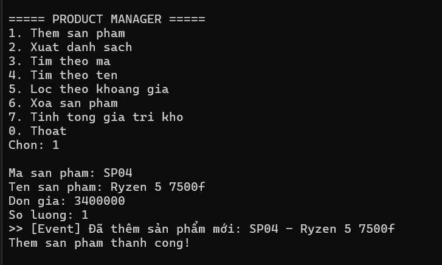

### Test 2: Xuất danh sách sản phẩm

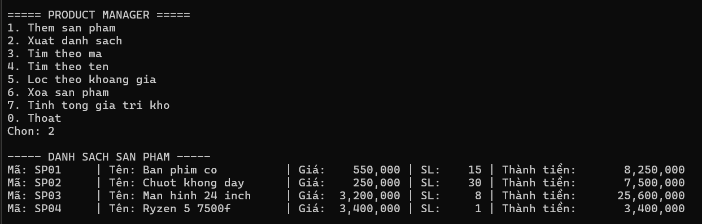

### Test 3: Tìm sản phẩm theo mã

Nhập mã sản phẩm cần tìm.

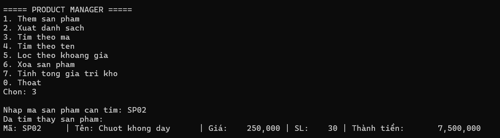

Nếu sản phẩm tồn tại, chương trình hiển thị thông tin sản phẩm.

Nếu không tồn tại, chương trình phát sinh `ProductNotFoundException` và thông báo lỗi.

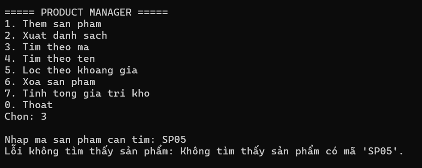

---

### Test 4: Tìm sản phẩm theo tên

Nhập từ khóa cần tìm.

Ví dụ:

```text
Tu khoa: Ryzen 5 7500f
```

Chương trình hiển thị các sản phẩm có tên chứa từ khóa.

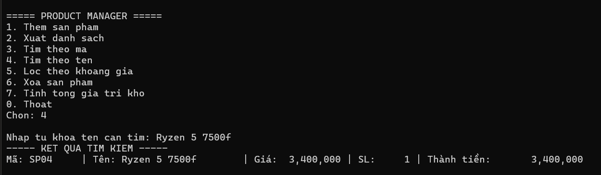

Chức năng này sử dụng điều kiện tìm kiếm thông qua `Func<Product, bool>`.

---

### Test 5: Lọc sản phẩm theo khoảng giá

Nhập:

```text
Giá nhỏ nhất
Giá lớn nhất
```

Ví dụ:

```text
Giá nhỏ nhất: 1000000
Giá lớn nhất: 4000000
```

Chương trình chỉ hiển thị các sản phẩm có giá nằm trong khoảng đã nhập.

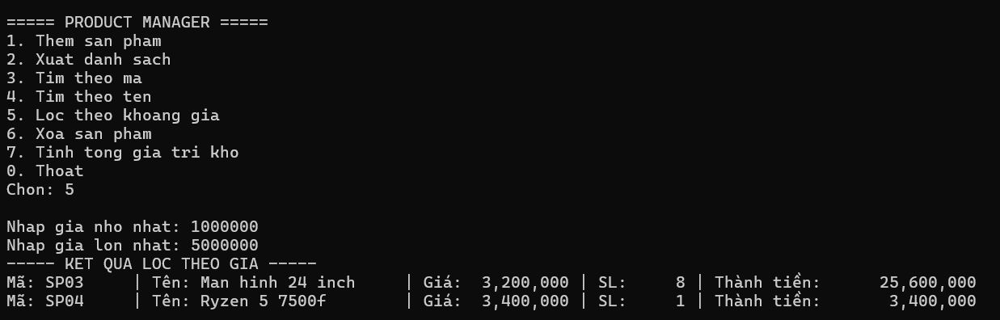

Chức năng sử dụng:

```csharp
Func<Product, bool>
```

để truyền điều kiện lọc.

---

### Test 6: Xóa sản phẩm

Nhập mã sản phẩm cần xóa.

Nếu sản phẩm tồn tại, sản phẩm sẽ được xóa khỏi repository.

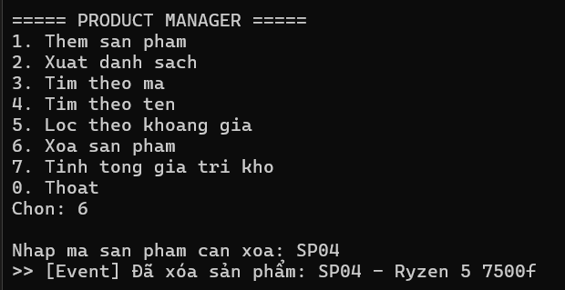

---

### Test 7: Tính tổng giá trị kho

Chương trình tính tổng giá trị của tất cả sản phẩm theo công thức:

```text
Tổng giá trị kho = Σ (Đơn giá × Số lượng)
```

Ví dụ:

```text
Sản phẩm 1: 550.000 × 15 = 8.250.000
Sản phẩm 2: 250.000 × 30 = 7.500.000
Sản phẩm 3: 3200000 x 8 = 25.600.000

Tổng giá trị kho = 41,350,000
```

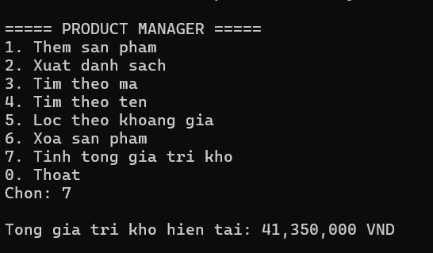

### Test 8: Thoát chương trình

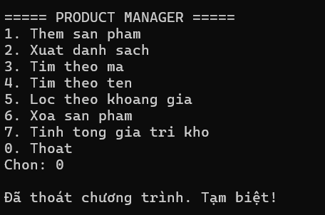

---

## 9. Kiểm tra Exception

### Test 9.1: Nhập giá trị âm

`Price` không được nhỏ hơn `0`.

Ví dụ nhập:

```text
Price = -100000
```

Chương trình thông báo dữ liệu không hợp lệ và yêu cầu nhập lại.

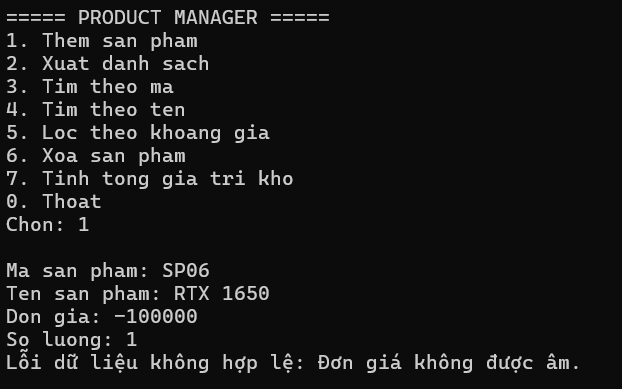

---

### Test 9.2: Nhập số lượng âm

`Quantity` không được nhỏ hơn `0`.

Ví dụ nhập:

```text
Quantity = -1
```

Chương trình thông báo dữ liệu không hợp lệ và yêu cầu nhập lại.

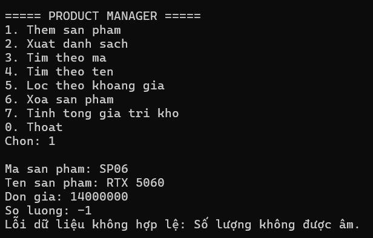

---

### Test 9.3: Thêm sản phẩm có mã bị trùng

Nhập mã sản phẩm đã tồn tại trong danh sách.

Ví dụ:

```text
Mã sản phẩm: SP01
```

Nếu `SP01` đã tồn tại, chương trình phát sinh:

```text
DuplicateProductException
```

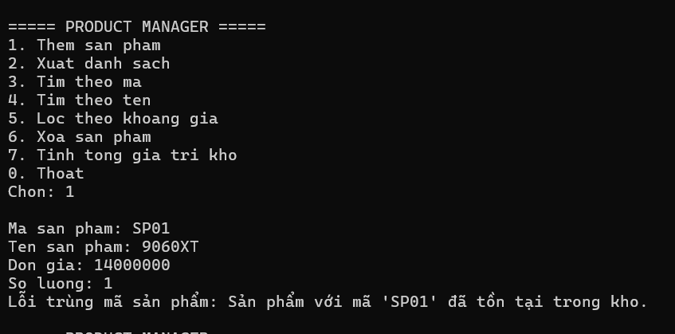

---

### Test 9.4: Xóa sản phẩm không tồn tại

Nhập mã sản phẩm không có trong danh sách.

Ví dụ:

```text
Mã sản phẩm: SP999
```

Chương trình phát sinh:

```text
ProductNotFoundException
```

và hiển thị thông báo phù hợp.

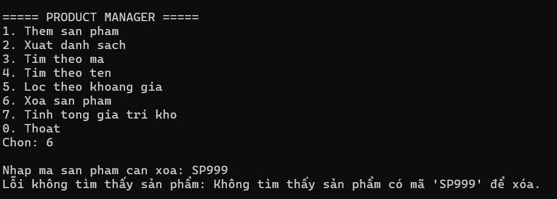

---

### Test 9.5: Nhập sai kiểu dữ liệu

Khi người dùng nhập chữ thay vì số đối với giá hoặc số lượng, chương trình không bị dừng đột ngột.

Ví dụ:

```text
Price: abc
```

Chương trình thông báo dữ liệu không hợp lệ và yêu cầu nhập lại.

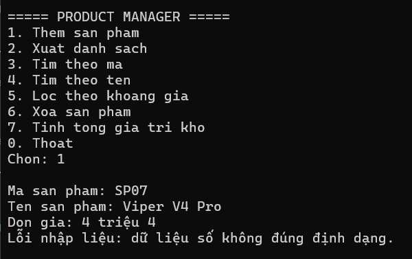

---

## 10. Kiến thức đã áp dụng

Qua bài Lab 04, chương trình đã áp dụng các kiến thức:

* `try-catch`.
* `throw`.
* Custom Exception.
* Delegate.
* Event.
* `Action`.
* `Func<T, bool>`.
* Generic Class.
* Generic Constraint.
* Interface.
* `List<T>`.
* LINQ.
* Lập trình hướng đối tượng.
* Tách chương trình thành nhiều class.
* Xử lý dữ liệu nhập sai.

---

## 11. Kết luận

Bài Lab 04 giúp áp dụng các kiến thức nâng cao trong C# vào bài toán **quản lý sản phẩm**.

Chương trình đã sử dụng **Exception** để xử lý lỗi, **Custom Exception** để xử lý các trường hợp mã sản phẩm bị trùng hoặc sản phẩm không tồn tại, **Event** để thông báo khi dữ liệu thay đổi, **Func<Product, bool>** để tìm kiếm và lọc dữ liệu, đồng thời sử dụng **Generic Repository<T>** để quản lý danh sách đối tượng.

Việc tách chương trình thành `Repository<T>`, `ProductService` và `Program` giúp chương trình rõ ràng, dễ quản lý và dễ mở rộng hơn.
